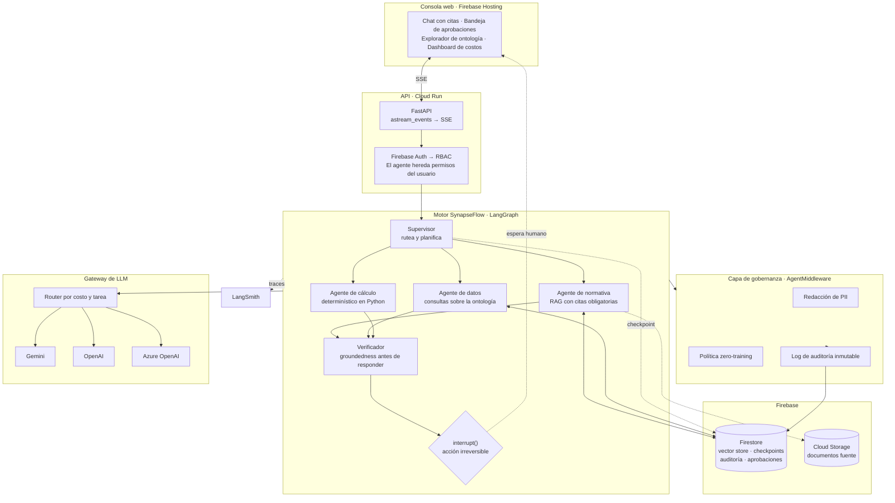

<div align="center">

[English](README.md) · **Español**

# SynapseFlow

**Plataforma de agentes gobernados para industrias reguladas.**

Sobre LangGraph y LangChain 1.x · desplegada en Firebase

[](LICENSE)
[](pyproject.toml)
[](pyproject.toml)
[](pyproject.toml)
[](https://github.com/leanaraque/SynapseFlow/actions/workflows/ci.yml)

[Arquitectura](#arquitectura) ·
[Decisiones de diseño](#las-cinco-decisiones-que-definen-el-proyecto) ·
[Estado](#estado-del-proyecto) ·
[Empezar](#empezar) ·
[ADRs](docs/adr)

</div>

> [!NOTE]
> **Proyecto en construcción.** La capa de ontología y la de persistencia están
> implementadas y con tests. El grafo de agentes, la API y la consola web están
> en curso. El [estado del proyecto](#estado-del-proyecto) dice exactamente qué
> corre hoy y qué no — y la sección [Empezar](#empezar) solo documenta comandos
> que funcionan de verdad.

---

## El problema

Poner un agente en producción dentro de una empresa regulada no falla por el
modelo. Falla por todo lo que rodea al modelo.

Un agente que consulta normativa técnica y puede emitir una orden de trabajo
sobre un equipo en servicio enfrenta preguntas que un notebook no responde:

- ¿Con qué autoridad ejecutó esa acción? ¿Heredó los permisos del usuario o los
  de la cuenta de servicio?
- ¿Qué fragmento exacto de qué norma sostiene esa respuesta? ¿Y si la norma
  está derogada?
- ¿Salió el legajo de una persona hacia un proveedor de LLM externo?
- ¿Quién aprobó la parada del equipo? ¿Queda registro de que fue un humano?
- Cuando el prompt cambie el mes que viene, ¿cómo sabés que no empeoró?

SynapseFlow es una implementación de referencia de esa capa faltante: el
andamiaje que convierte un grafo de agentes en un sistema que un auditor puede
revisar.

## Qué hace

El dominio implementado es **integridad de activos de petróleo y gas**: un
asistente que responde sobre normativa de inspección, consulta el historial de
un equipo, calcula vida remanente y —con aprobación humana explícita— emite
órdenes de trabajo o solicita la parada de un activo.

El comportamiento objetivo del sistema completo:

```
Usuario: El P-2101-A midió 6,8 mm en la última inspección. ¿Sigue apto?

SynapseFlow:
  → consultar_activo(P-2101-A)              [t_min = 7,1 mm · criticidad A]
  → historial_inspecciones(P-2101-A)        [4 mediciones, 2019-2026]
  → calcular_vida_remanente(P-2101-A)       [Python, no el modelo]
  → buscar_normativa("espesor por debajo de t_min")

  El activo NO está apto para continuar en servicio. El espesor medido
  (6,8 mm) está por debajo del mínimo requerido (7,1 mm).

  API 570 §7.4 exige que un componente cuyo espesor sea inferior a t_min
  sea retirado de servicio o sometido a evaluación de aptitud según
  API 579. La velocidad de corrosión calculada es 0,21 mm/año y la vida
  remanente es negativa: −1,4 años.

  Fuentes: API-570-2016 §7.4 · API-570-2016 §5.6 · PROC-INT-014 §3.2

  ⚠ Acción irreversible propuesta: solicitar_parada_equipo(P-2101-A)
    Requiere aprobación de un supervisor de mantenimiento.
    [ Aprobar ]  [ Rechazar ]
```

El agente no ejecuta la parada. La propone, la fundamenta y espera a un humano.

> Este es el diseño objetivo, no una sesión capturada: el grafo de agentes está
> en construcción. Lo que sí está implementado y verificado hoy es el catálogo
> de herramientas que se ve arriba —derivado de la ontología, filtrado por rol—
> y el mecanismo de aprobación que sostiene ese último bloque.

## Arquitectura



## Las cinco decisiones que definen el proyecto

**1. La ontología es declarativa, no código.** ✅ implementado
Entidades, relaciones y acciones viven en
[`oil_and_gas.yaml`](packages/synapseflow/ontology/definitions/oil_and_gas.yaml).
De ese archivo se derivan en tiempo de arranque los modelos de validación, el
catálogo de herramientas que ven los agentes, los permisos por rol y la
clasificación de datos. Cambiar de dominio es cambiar el YAML.
→ [ADR-0003](docs/adr/0003-ontologia-declarativa-en-yaml.md)

**2. La reversibilidad es un atributo del dominio, no un `if` en el código.** ✅ implementado
Cada acción declara `reversible` y `requires_approval`. El compilador de
herramientas lee esos campos y produce la configuración del gate de aprobación.
Un desarrollador no puede olvidarse de poner el gate: si la acción es
irreversible, el gate existe.
→ [ADR-0005](docs/adr/0005-hitl-con-interrupt-de-langgraph.md)

**3. El modelo no calcula números.** 🚧 en curso
Velocidad de corrosión y vida remanente se computan en Python determinístico y
se le entregan al modelo como hecho. El LLM redacta y fundamenta; no estima
magnitudes que después firma un ingeniero.

**4. Sin cita no hay respuesta.** 🚧 en curso
El agente de normativa está obligado a devolver documento y sección. Un nodo
verificador comprueba que cada afirmación tenga respaldo en el contexto
recuperado antes de emitir. Si no lo tiene, el sistema dice que no sabe.

**5. Los datos sensibles no salen del perímetro.** 🚧 en curso
Los campos marcados `pii` o `restricted` en la ontología se tokenizan antes de
la llamada al proveedor y se rehidratan en la respuesta. El modelo externo ve
`«INSPECTOR_1»`, nunca un legajo. La derivación de esos campos desde la
ontología ya funciona; falta cablearla al gateway.
→ [ADR-0004](docs/adr/0004-gateway-provider-agnostic.md)

## Estado del proyecto

| Componente | Estado | Verificación |
|---|---|---|
| Ontología: meta-esquema y validación | ✅ | invariantes forzadas al cargar; probadas por mutación |
| Ontología: compilador a herramientas de LangChain | ✅ | 9 acciones, schemas con enums, filtrado por rol |
| Ontología: RBAC y campos PII derivados | ✅ | ningún rol actúa por encima de su clasificación — si pudiera, la carga falla |
| Gates de aprobación derivados de la ontología | ✅ | un agente real se detiene en el gate; aprobar ejecuta lo propuesto |
| `FirestoreSaver` — checkpointer de LangGraph | ✅ | 8 tests contra el emulador |
| `FirestoreVectorStore` — `find_nearest` nativo | ✅ | implementado; tests de integración pendientes |
| CLI de inspección | ✅ | `synapseflow ontology validate` |
| Reglas e índices de Firestore | ✅ | declarados y versionados |
| Datos sintéticos del dominio | ✅ | 60 activos y 292 inspecciones, reproducibles por semilla |
| Corpus de normativa | ✅ | 6 documentos, 42 secciones citables, uno derogado |
| Carga idempotente a Firestore | ✅ | cargado dos veces contra el emulador, el conteo no cambia |
| Tests de coherencia de los datos | ✅ | 45 tests sobre tres semillas |
| Registry de modelos: perfil + proveedor → modelo | ✅ | un modelo de embeddings que no coincide con el índice vectorial no se puede resolver |
| Gateway de LLM multi-proveedor | 🚧 | registry listo; falta escribir `gateway.py` y `callbacks.py` |
| Middlewares de gobernanza | 📋 | diseño cerrado sobre `AgentMiddleware` de LC 1.x |
| RAG híbrido con citas | 📋 | |
| Grafo de agentes | 📋 | |
| API en Cloud Run | 📋 | |
| Consola web | 📋 | |
| Suite de evals y CI de regresión | 📋 | |

✅ implementado y verificado · 🚧 en curso · 📋 planificado

El [mapa de acción](docs/06-mapa-de-accion.md) desglosa el trabajo restante en
ocho fases, cada una con sus dependencias, sus entregables y —sobre todo— cómo se
verifica. Además lleva la cuenta de cuáles de los cinco compromisos de diseño del
proyecto están operativos y cuáles siguen solamente declarados.

**Si vas a retomar el desarrollo**, empezá por [`docs/plan/`](docs/plan/), que
tiene el mismo mapa desglosado commit por commit. No adivines en qué estado está
el proyecto: preguntáselo.

```bash
python -m scripts.estado
```

Ese comando inspecciona el repositorio y reporta la fase actual, el commit
siguiente, qué falta exactamente para darlo por hecho y cómo verificarlo. El
estado se deriva del código y no se mantiene a mano, así que no se puede
desincronizar.

## Empezar

Todo lo de esta sección funciona hoy. No necesita API key, ni Firebase, ni red.

```bash
git clone https://github.com/leanaraque/SynapseFlow.git
cd SynapseFlow

python -m venv .venv
source .venv/bin/activate        # Windows: .venv\Scripts\activate
pip install -e ".[dev]"
```

### Inspeccionar el dominio

```bash
# Valida la ontología y reporta las invariantes de gobernanza
synapseflow ontology validate

# Mínimo privilegio: qué herramientas ve cada rol
synapseflow ontology tools --role tecnico
synapseflow ontology tools --role auditor

# Alcance de cada rol, de un vistazo
synapseflow ontology roles

# Diagrama de entidades en Mermaid, listo para pegar
synapseflow ontology graph
```

`synapseflow ontology tools --role tecnico` produce:

```
Rol        tecnico — Técnico de mantenimiento
Clasif.    hasta 'internal'
Ve         5 de 9 acciones del dominio

HERRAMIENTA            EFECTO  PARÁMETROS                                      GATE
─────────────────────  ──────  ──────────────────────────────────────────────  ────────────────────
buscar_normativa       read    consulta, tipo_documento
consultar_activo       read    tag
listar_activos         read    instalacion, clase, criticidad, estado, limite
registrar_borrador_ot  write   tag, tipo, descripcion_trabajo, prioridad       escritura reversible
emitir_orden_trabajo   write   id_ot                                           requiere aprobación
```

### Tests

```bash
# Sin dependencias externas: consistencia del plan de trabajo.
pytest -m "not emulator"

# La suite completa. Necesita el emulador de Firestore en otra terminal.
firebase emulators:start --only firestore --project synapseflow-5fc52
pytest
```

> La suite tiene 149 tests. 141 no necesitan nada instalado —ni API key, ni
> red—: 45 verifican propiedades de los datos generados y del corpus de
> normativa, 44 cubren el registry de modelos y el modelo falso, 35 la ontología
> y la CLI, y 17 que el plan de trabajo sea seguible. Los 8 restantes ejercitan
> el checkpointer contra el emulador de Firestore.

Cuatro de los tests de ontología corren un **agente real** —`create_agent` con
`HumanInTheLoopMiddleware`— contra los gates derivados del YAML, gobernado por
un modelo falso determinístico. Verifican que el agente se detenga antes de una
acción irreversible, que una lectura reversible *no* se frene, que aprobar
ejecute exactamente lo propuesto y que rechazar no materialice nada.

El test que más importa es
[`test_hitl_sobrevive_a_la_muerte_del_proceso`](tests/persistence/test_checkpointer.py):
corre el grafo hasta el gate de aprobación, **descarta el grafo y el saver**,
los reconstruye desde cero y reanuda con `Command(resume=...)`, verificando que
la acción ejecutada tenga los argumentos idénticos a los propuestos. Es la
promesa del human-in-the-loop asincrónico, demostrada en lugar de afirmada.

## Estructura del repositorio

```
packages/synapseflow/
  config.py              toda la configuración ambiental, en un solo lugar
  cli.py                 inspección del dominio sin credenciales
  ontology/
    definitions/*.yaml   el dominio como dato: entidades, relaciones, acciones
    schema.py            meta-esquema Pydantic estricto
    loader.py            carga y validación con errores accionables
    compiler.py          YAML → herramientas de LangChain + gates + RBAC
  persistence/
    client.py            cliente de Firestore compartido por proceso
    vectorstore.py       VectorStore sobre find_nearest nativo
    checkpointer.py      BaseCheckpointSaver de LangGraph
  llm/
    models.yaml          catálogo de modelos, perfiles de tarea y precios
    registry.py          perfil + proveedor → modelo, costo, chequeo de dimensión
data/corpus/*.md         corpus de normativa, versionado: es fuente, no derivado
scripts/
  estado.py              detector de la fase actual, derivada del código
  generar_datos.py       datos sintéticos reproducibles por semilla
docs/adr/                decisiones de arquitectura, con sus alternativas
docs/plan/               el plan commit a commit, con sus convenciones
tests/                   contrato de la persistencia y consistencia del plan
firestore.rules          el cliente no habla con Firestore; la API aplica RBAC
firestore.indexes.json   índices vectoriales y compuestos
```

## Stack

| Capa | Tecnología |
|---|---|
| Orquestación de agentes | LangGraph — supervisor, subgrafos, `interrupt()`, checkpointing |
| Composición y middlewares | LangChain 1.x — `create_agent`, `AgentMiddleware`, tool calling |
| Recuperación | RAG híbrido: `FirestoreVectorStore` + BM25 vía `EnsembleRetriever` |
| Persistencia de estado | `BaseCheckpointSaver` propio sobre Firestore |
| Observabilidad | LangSmith — tracing, datasets, experiments |
| Modelos | Gemini (default) · OpenAI · Azure OpenAI, detrás de un gateway |
| API | FastAPI en Cloud Run, streaming por SSE |
| Frontend | React + Vite en Firebase Hosting |
| Datos | Firestore con búsqueda vectorial nativa · Cloud Storage |
| Identidad | Firebase Auth → RBAC derivado de la ontología |

## Decisiones de arquitectura

Cada decisión no trivial está documentada con su contexto, las alternativas que
se descartaron y por qué, las consecuencias en contra y cómo se verifica.

| ADR | Decisión |
|---|---|
| [0001](docs/adr/0001-langgraph-como-motor-de-orquestacion.md) | LangGraph como motor de orquestación |
| [0002](docs/adr/0002-integraciones-firestore-propias.md) | Integraciones de Firestore propias, no el paquete oficial |
| [0003](docs/adr/0003-ontologia-declarativa-en-yaml.md) | La ontología del dominio es declarativa y vive fuera del código |
| [0004](docs/adr/0004-gateway-provider-agnostic.md) | Gateway de modelos con frontera de datos explícita |
| [0005](docs/adr/0005-hitl-con-interrupt-de-langgraph.md) | Los gates de aprobación usan `interrupt()` de LangGraph |

## Alcance y honestidad

Conviene ser explícito sobre qué es y qué no es esto.

- **Los datos son sintéticos.** Instalaciones, activos, inspecciones y órdenes
  de trabajo están generados. No provienen de ninguna operación real ni de
  ningún cliente.
- **El corpus normativo es una reescritura.** Los textos que se indexan
  parafrasean la estructura y el criterio técnico de los códigos de inspección
  en servicio de API, pero no reproducen su contenido, que es material con
  derechos. Sirven para ejercitar el RAG con la forma real del problema.
- **Es una implementación de referencia,** no un producto en operación.
- El objetivo es demostrar la arquitectura y las prácticas de ingeniería que
  requiere llevar agentes a producción en un entorno regulado.

## Idioma del proyecto

El código, los comentarios y los ADRs están en **español**. Es una decisión
deliberada, explicada en [CONTRIBUTING.md](CONTRIBUTING.md#estilo): el dominio
es normativa técnica en español y mezclar idiomas entre el YAML del dominio y el
código que lo interpreta genera fricción al leer.

Los nombres de símbolos de LangChain y LangGraph se mantienen en inglés
(`BaseCheckpointSaver`, `interrupt`, `AgentMiddleware`).

## Contribuir

Ver [CONTRIBUTING.md](CONTRIBUTING.md). Para reportar una vulnerabilidad, ver
[SECURITY.md](SECURITY.md).

## Licencia

MIT — ver [LICENSE](LICENSE).
