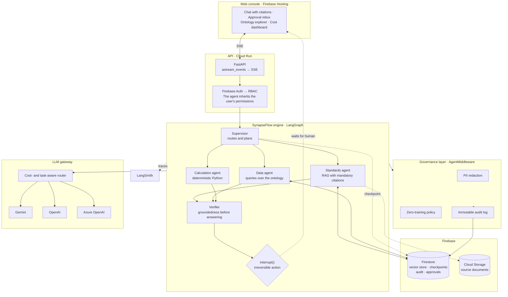

<div align="center">

**English** · [Español](README.es.md)

# SynapseFlow

**A governed agent platform for regulated industries.**

Built on LangGraph and LangChain 1.x · deployed on Firebase

[](LICENSE)
[](pyproject.toml)
[](pyproject.toml)
[](pyproject.toml)
[](https://github.com/leanaraque/SynapseFlow/actions/workflows/ci.yml)

[Architecture](#architecture) ·
[Design decisions](#the-five-decisions-that-define-the-project) ·
[Status](#project-status) ·
[Getting started](#getting-started) ·
[ADRs](docs/adr)

</div>

> [!NOTE]
> **The 43-commit plan is finished; the system is not deployed.** Every layer —
> ontology, persistence, gateway, domain actions, RAG, governance, agent graph,
> evals, API and console — is built and tested. What is missing is material and
> stated as such: the container image has not been built, nothing has been
> published, and two console features listed in the roadmap were not built.
> The [project status](#project-status) table says exactly what runs today, and
> [Getting started](#getting-started) only documents commands that actually work.

---

## The problem

Getting an agent into production inside a regulated company does not fail
because of the model. It fails because of everything around the model.

An agent that reads technical standards and can issue a work order against
equipment in service faces questions a notebook never answers:

- Under whose authority did it execute that action? Did it inherit the user's
  permissions, or the service account's?
- Which exact clause of which standard supports that answer? And what if the
  standard has been superseded?
- Did a person's employee ID leave the perimeter toward an external LLM
  provider?
- Who approved shutting down the equipment? Is there a record that it was a
  human?
- When the prompt changes next month, how do you know it did not get worse?

SynapseFlow is a reference implementation of that missing layer: the scaffolding
that turns an agent graph into a system an auditor can review.

## What it does

The implemented domain is **oil and gas asset integrity**: an assistant that
answers questions about inspection standards, queries an asset's history,
computes remaining life and — with explicit human approval — issues work orders
or requests that an asset be taken out of service.

The target behaviour of the complete system:

```
Usuario: El P-2101-A midió 6,8 mm en la última inspección. ¿Sigue apto?

SynapseFlow:
  → consultar_activo(P-2101-A)              [t_min = 7,1 mm · criticidad A]
  → historial_inspecciones(P-2101-A)        [4 mediciones, 2019-2026]
  → calcular_vida_remanente(P-2101-A)       [Python, no el modelo]
  → buscar_normativa("espesor por debajo de t_min")

  El activo NO está apto para continuar en servicio. El espesor medido
  (6,8 mm) está por debajo del mínimo requerido (7,1 mm).

  API 570 §7.4 exige que un componente cuyo espesor sea inferior a t_min
  sea retirado de servicio o sometido a evaluación de aptitud según
  API 579. La velocidad de corrosión calculada es 0,21 mm/año y la vida
  remanente es negativa: −1,4 años.

  Fuentes: API-570-2016 §7.4 · API-570-2016 §5.6 · PROC-INT-014 §3.2

  ⚠ Acción irreversible propuesta: solicitar_parada_equipo(P-2101-A)
    Requiere aprobación de un supervisor de mantenimiento.
    [ Aprobar ]  [ Rechazar ]
```

The agent does not execute the shutdown. It proposes it, justifies it, and waits
for a human.

> That transcript is the target design, not a captured session: the agent graph
> is still being built. What *is* implemented and verified today is the tool
> catalogue shown above — derived from the ontology and filtered by role — and
> the approval mechanism behind that last block.
>
> The domain is modelled in Spanish, so tool names and output are in Spanish.
> See [Project language](#project-language).

## Architecture



## The five decisions that define the project

**1. The ontology is declarative, not code.** ✅ implemented
Entities, relations and actions live in
[`oil_and_gas.yaml`](packages/synapseflow/ontology/definitions/oil_and_gas.yaml).
At startup that single file produces the validation models, the tool catalogue
the agents see, the per-role permissions and the data classification. Changing
domain means changing the YAML.
→ [ADR-0003](docs/adr/0003-ontologia-declarativa-en-yaml.md)

**2. Reversibility is a property of the domain, not an `if` in the code.** ✅ implemented
Every action declares `reversible` and `requires_approval`. The tool compiler
reads those fields and emits the approval gate configuration. A developer cannot
forget to add the gate: if the action is irreversible, the gate exists.

Enforced on the **running graph**, not just on the compiled catalogue: a
structural test walks every role and asserts no irreversible action is reachable
without its gate, and the end-to-end test drives the P-2101-A case until the
agent proposes a shutdown — then checks the asset is *still* `en_servicio` in
Firestore. A gate that fires after the write is not a gate.
→ [ADR-0005](docs/adr/0005-hitl-con-interrupt-de-langgraph.md) ·
[`test_recorrido_completo.py`](tests/agents/test_recorrido_completo.py)

**3. The model does not compute numbers.** ✅ implemented
Corrosion rate and remaining life are computed in deterministic Python and handed
to the model as fact. The LLM writes and justifies; it does not estimate
magnitudes that an engineer will later sign off on. Following API 570 §7, both
the long-term and the short-term corrosion rate are computed and the **higher**
one governs — an asset that corroded slowly for years and accelerated in the last
campaign has a new problem, and averaging it away hides it exactly when it
matters.
→ [`calculos.py`](packages/synapseflow/domain/calculos.py)

**4. No citation, no answer.** ✅ implemented
The standards agent is required to return document and clause. A verifier checks
that every claim is supported by the retrieved context before the answer is
emitted. If it is not, the system says it does not know — and the refusal is
fixed text, not generated: asking the model to write its own refusal leaves it
improvising exactly when we have just established it has nothing to go on.
Citations are validated against **what was actually retrieved**, not against the
corpus: a model citing a real clause that was not in its context did not read it.
→ [`fundamento.py`](packages/synapseflow/rag/fundamento.py)

**5. Sensitive data does not leave the perimeter.** ✅ implemented
Fields marked `pii` or `restricted` in the ontology are tokenised before the
provider call and rehydrated in the response. The external model sees
`«INSPECTOR_1»`, never an employee ID. The token is a **per-conversation
counter, not a hash**: with only a hundred thousand possible employee IDs, a hash
is recovered by brute force — it obfuscates, it does not anonymise.

Proven on a running agent, not on the tokeniser in isolation: a tool returns two
employee IDs, and the test asserts the model never saw them, that it *did* see
the tokens, and that the user gets the real IDs back. A negative control turns
the redaction off and checks the same run leaks — otherwise the guarantee could
pass by proving nothing.
→ [`test_frontera_datos.py`](tests/governance/test_frontera_datos.py) ·
[ADR-0004](docs/adr/0004-gateway-provider-agnostic.md)

## Project status

| Component | Status | Verification |
|---|---|---|
| Ontology: meta-schema and validation | ✅ | invariants enforced at load time; mutation-tested |
| Ontology: compiler to LangChain tools | ✅ | 9 actions, enum-typed schemas, role filtering |
| Ontology: derived RBAC and PII fields | ✅ | no role can act above its classification — the load fails if one could |
| Approval gates derived from the ontology | ✅ | a real agent stops at the gate; approving runs exactly what was proposed |
| `FirestoreSaver` — LangGraph checkpointer | ✅ | 8 tests against the emulator |
| `FirestoreVectorStore` — native `find_nearest` | ✅ | implemented; integration tests pending |
| Inspection CLI | ✅ | `synapseflow ontology validate` |
| Firestore rules and indexes | ✅ | declared and versioned |
| Synthetic domain data | ✅ | 60 assets and 292 inspections, reproducible from a seed |
| Standards corpus | ✅ | 6 documents, 42 citable clauses, one superseded |
| Idempotent Firestore seeding | ✅ | loaded twice against the emulator, counts unchanged |
| Data coherence tests | ✅ | 45 tests over three seeds |
| Model registry: profile + provider → model | ✅ | an embeddings model that does not match the vector index cannot be resolved |
| Multi-provider LLM gateway | ✅ | four adapters behind one exit point; a task profile is asked for, never a model name |
| The nine domain actions, implemented | ✅ | the full catalogue compiles for every role — before this it refused to |
| Deterministic remaining-life calculation | ✅ | API 570 §7, long- and short-term rates, the higher one governs |
| Hybrid RAG with citations | ✅ | vector + BM25; the currency filter applies to **both** branches |
| Groundedness verifier | ✅ | three verdicts; an invented citation is rejected without calling the model |
| Governance middleware | ✅ | reversible PII tokenisation, gates from the ontology, per-turn call ceiling |
| Immutable audit log | ✅ | append-only; keeps `thread_id` and `checkpoint_id` to rebuild the reasoning |
| Separation of duties on approvals | ✅ | the proposer cannot approve their own action |
| Agent graph: supervisor, specialists, verifier | ✅ | the full P-2101-A journey stops at the gate and the asset stays in service |
| Approval gates applied on the running graph | ✅ | structural test over every role: no irreversible action is reachable without its gate |
| Eval suite and regression CI | ✅ | four deterministic metrics and one judged; refusal is scored in **both** directions |
| Firestore provisioned in the cloud | ✅ | `nam5`, rules and indexes deployed, 768-dim vector search verified against the real base |
| Zero-training policy enforced at the gateway | ✅ | a provider the catalogue does not vouch for is rejected at startup |
| Single data-exit path, structurally enforced | ✅ | the AST of every module is walked; a second exit path fails the build |
| Per-call cost accounting | ✅ | priced by the model that actually ran, not the profile requested |
| API identity: Firebase token → execution context | ✅ | a user without a valid role gets a 403, never a default role |
| SSE streaming | ✅ | tool events before the answer; citations before the approval prompt |
| Approval endpoints | ✅ | the proposer cannot approve their own action; approving sends no arguments |
| Cloud Run image and deployment | 🚧 | multi-stage image and ADR-0006 written; `docker build` still pending |
| Web console | ✅ | chat, inspectable citations and the approval inbox |
| Deployment | 📋 | runbook written and verified against the config; nothing published yet |

✅ implemented and verified · 🚧 in progress · 📋 planned

The [action map](docs/06-mapa-de-accion.md) breaks the work into eight phases,
each with its dependencies, deliverables and — most importantly — how it gets
verified. All eight are done, and all five design commitments are operative.

**What was not built**, stated plainly because a finished plan is not a finished
product: the container image has never been built and nothing has been deployed —
**the project's billing account is closed**, so Artifact Registry, Cloud Build and
Cloud Run all answer `BILLING_DISABLED`; the ontology explorer was reduced to a
single "my role" screen showing the compiled catalogue, and the cost dashboard
was not built at all — `llm_usage` is written and has no reader.
[Deployment](docs/05-despliegue.md) is written down and checked against the
config, but never executed.

**If you're picking up development**, start at [`docs/plan/`](docs/plan/), which
holds the same roadmap broken down commit by commit. Don't guess where the
project stands — ask it:

```bash
python -m scripts.estado
```

That command inspects the repository and reports the current phase, the next
commit, what exactly is missing for it, and how to verify it. The state is
derived from the code, never kept by hand, so it cannot drift.

## Getting started

Everything in this section works today. No API key, no Firebase, no network
access required.

```bash
git clone https://github.com/leanaraque/SynapseFlow.git
cd SynapseFlow

python -m venv .venv
source .venv/bin/activate        # Windows: .venv\Scripts\activate
pip install -e ".[dev]"
```

### Inspect the domain

```bash
# Validates the ontology and reports the governance invariants
synapseflow ontology validate

# Least privilege: which tools each role can see
synapseflow ontology tools --role tecnico
synapseflow ontology tools --role auditor

# Scope of every role, at a glance
synapseflow ontology roles

# Entity diagram as Mermaid, ready to paste
synapseflow ontology graph
```

`synapseflow ontology tools --role tecnico` produces:

```
Rol        tecnico — Técnico de mantenimiento
Clasif.    hasta 'internal'
Ve         5 de 9 acciones del dominio

HERRAMIENTA            EFECTO  PARÁMETROS                                      GATE
─────────────────────  ──────  ──────────────────────────────────────────────  ────────────────────
buscar_normativa       read    consulta, tipo_documento
consultar_activo       read    tag
listar_activos         read    instalacion, clase, criticidad, estado, limite
registrar_borrador_ot  write   tag, tipo, descripcion_trabajo, prioridad       escritura reversible
emitir_orden_trabajo   write   id_ot                                           requiere aprobación
```

### Tests

```bash
# No external dependencies: work-plan consistency.
pytest -m "not emulator"

# The whole suite. Needs the Firestore emulator in another terminal.
firebase emulators:start --only firestore --project synapseflow-5fc52
pytest
```

> The suite has 863 tests. **776 need nothing installed — no API key, no
> network:** 95 cover the agent graph — routing, the verifier cycle, the
> structural gate property — 93 the LLM gateway, registry, fake model and cost
> accounting, 129 the API — identity, the SSE stream, the approval endpoints and
> the Cloud Run image —
> 91 governance, 84 the eval suite and its regression CI, 59 the deterministic
> calculation and the compiled tool catalogue, 56 ingestion, citations and the
> groundedness verifier, 45 properties of the generated data and the standards
> corpus, 35 the ontology and the CLI, 72 the console — its client-side boundary, its event contract with
> the API, the approval inbox and the deployment configuration — and 17 that the
> work plan is followable. The console adds 11 of its
> own, in `vitest`, over the only non-trivial client-side logic: the SSE reader.
> Of the rest, 82 run
> against the Firestore emulator — including the full P-2101-A journey — and 5
> call a real provider; those last ones are marked `live_llm` and are **not**
> part of `pytest`'s default run in CI.

Four of the ontology tests run a **real agent** — `create_agent` with
`HumanInTheLoopMiddleware` — against gates derived from the YAML, driven by a
deterministic fake model. They assert that the agent stops before an
irreversible action, that a reversible read is *not* stopped, that approving
executes exactly what was proposed, and that rejecting materialises nothing.

The test that matters most is
[`test_hitl_sobrevive_a_la_muerte_del_proceso`](tests/persistence/test_checkpointer.py)
("HITL survives process death"): it runs the graph up to the approval gate,
**discards both the graph and the saver**, rebuilds them from scratch and
resumes with `Command(resume=...)`, asserting that the executed action carries
arguments identical to the proposed ones. It is the asynchronous
human-in-the-loop promise, demonstrated rather than claimed.

## Repository layout

```
packages/synapseflow/
  config.py              all environment configuration, in one place
  cli.py                 domain inspection without credentials
  ontology/
    definitions/*.yaml   the domain as data: entities, relations, actions
    schema.py            strict Pydantic meta-schema
    loader.py            loading and validation with actionable errors
    compiler.py          YAML → LangChain tools + gates + RBAC
  persistence/
    client.py            Firestore client shared per process
    vectorstore.py       VectorStore over native find_nearest
    checkpointer.py      LangGraph BaseCheckpointSaver
  llm/
    models.yaml          model catalogue, task profiles and pricing
    registry.py          profile + provider → model, cost, index-dimension check
data/corpus/*.md         standards corpus, versioned: it is source, not derived
services/api/
  auth.py                Firebase token → execution context; no default role
  main.py                FastAPI app; the graph is built per user, not per process
  streaming.py           astream_events → SSE; one terminal event, always
  aprobaciones.py        the inbox and Command(resume=); what was approved is what runs
  Dockerfile             multi-stage; dependencies before code, no credentials inside
apps/web/
  src/firebase.ts        the SDK's only door: Auth, never Firestore
  src/api.ts             the only place the Authorization header is built
  src/sse.ts             SSE reader over fetch: EventSource takes no headers
  src/Chat.tsx           tool events as they happen, citations with their currency
  src/Aprobaciones.tsx   exact arguments, buttons from the ontology, ageing shown
scripts/
  estado.py              current-phase detector, derived from the code
  generar_datos.py       synthetic data, reproducible from a seed
docs/adr/                architecture decisions, with their alternatives
docs/plan/               the commit-by-commit plan and its conventions
tests/                   persistence contract and work-plan consistency
firestore.rules          the client never talks to Firestore; the API applies RBAC
firestore.indexes.json   vector and composite indexes
```

## Stack

| Layer | Technology |
|---|---|
| Agent orchestration | LangGraph — supervisor, subgraphs, `interrupt()`, checkpointing |
| Composition and middleware | LangChain 1.x — `create_agent`, `AgentMiddleware`, tool calling |
| Retrieval | Hybrid RAG: `FirestoreVectorStore` + BM25 via `EnsembleRetriever` |
| State persistence | Custom `BaseCheckpointSaver` over Firestore |
| Observability | LangSmith — tracing, datasets, experiments |
| Models | Gemini (default) · OpenAI · Azure OpenAI, behind a gateway |
| API | FastAPI on Cloud Run, SSE streaming |
| Frontend | React + Vite on Firebase Hosting |
| Data | Firestore with native vector search · Cloud Storage |
| Identity | Firebase Auth → RBAC derived from the ontology |

## Architecture decisions

Every non-trivial decision is documented with its context, the alternatives that
were rejected and why, the consequences that count against it, and how it is
verified. The ADRs are written in Spanish.

| ADR | Decision |
|---|---|
| [0001](docs/adr/0001-langgraph-como-motor-de-orquestacion.md) | LangGraph as the orchestration engine |
| [0002](docs/adr/0002-integraciones-firestore-propias.md) | Custom Firestore integrations instead of the official package |
| [0003](docs/adr/0003-ontologia-declarativa-en-yaml.md) | The domain ontology is declarative and lives outside the code |
| [0004](docs/adr/0004-gateway-provider-agnostic.md) | Model gateway with an explicit data boundary |
| [0005](docs/adr/0005-hitl-con-interrupt-de-langgraph.md) | Approval gates use LangGraph's `interrupt()` |

## Scope and honesty

It is worth being explicit about what this is and what it is not.

- **The data is synthetic.** Installations, assets, inspections and work orders
  are generated. None of it comes from a real operation or a real client.
- **The standards corpus is a rewrite.** The indexed texts paraphrase the
  structure and technical criteria of API's in-service inspection codes, but do
  not reproduce their content, which is copyrighted material. They exist to
  exercise the RAG pipeline with the real shape of the problem.
- **This is a reference implementation,** not a system in operation.
- The goal is to demonstrate the architecture and the engineering practices that
  taking agents to production in a regulated environment actually requires.

## Project language

The code, the comments and the ADRs are written in **Spanish**. This is a
deliberate choice, explained in [CONTRIBUTING.md](CONTRIBUTING.md#estilo): the
domain is Spanish-language technical regulation, and mixing languages between the
domain YAML and the code that interprets it creates real friction when reading.

LangChain and LangGraph symbol names are kept in English
(`BaseCheckpointSaver`, `interrupt`, `AgentMiddleware`).

This README is available in [Español](README.es.md). Both versions are kept in
sync; CI fails if one changes without the other.

## Contributing

See [CONTRIBUTING.md](CONTRIBUTING.md). To report a vulnerability, see
[SECURITY.md](SECURITY.md).

## License

MIT — see [LICENSE](LICENSE).
