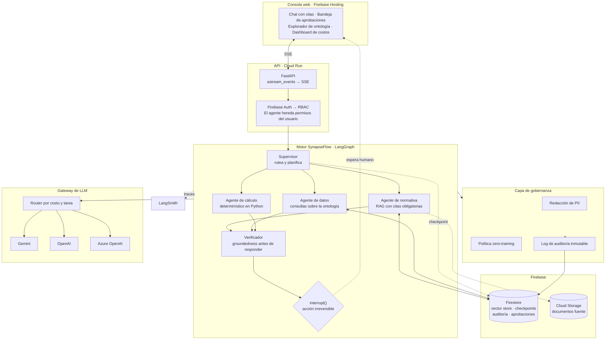

<div align="center">

# SynapseFlow

**Plataforma de agentes gobernados para industrias reguladas.**

Construida sobre LangGraph y LangChain, desplegada en Firebase.

[Arquitectura](docs/01-arquitectura.md) ·
[Gobernanza](docs/03-gobernanza-data-first.md) ·
[LLMOps](docs/04-llmops.md) ·
[Decisiones de arquitectura](docs/adr) ·
[Runbook](docs/05-runbook.md)

</div>

---

## El problema

Poner un agente en producción dentro de una empresa regulada no falla por el
modelo. Falla por todo lo que rodea al modelo.

Un agente que consulta normativa técnica y puede emitir una orden de trabajo
sobre un equipo en servicio enfrenta preguntas que un notebook no responde:

- ¿Con qué autoridad ejecutó esa acción? ¿Heredó los permisos del usuario o los
  de la cuenta de servicio?
- ¿Qué fragmento exacto de qué norma sostiene esa respuesta? ¿Y si la norma
  está derogada?
- ¿Salió un legajo de una persona hacia un proveedor de LLM externo?
- ¿Quién aprobó la parada del equipo? ¿Queda registro de que fue un humano?
- Cuando el prompt cambie el mes que viene, ¿cómo sabés que no empeoró?

SynapseFlow es una implementación de referencia de esa capa faltante: el
andamiaje que convierte un grafo de agentes en un sistema que un auditor puede
revisar.

## Qué hace

El dominio implementado es **integridad de activos de petróleo y gas**: un
asistente que responde sobre normativa de inspección, consulta el historial de
un equipo, calcula vida remanente y —con aprobación humana explícita— emite
órdenes de trabajo o solicita la parada de un activo.

```
Usuario: El P-2101-A midió 6,8 mm en la última inspección. ¿Sigue apto?

SynapseFlow:
  → consultar_activo(P-2101-A)              [t_min = 7,1 mm · criticidad A]
  → historial_inspecciones(P-2101-A)        [4 mediciones, 2019-2026]
  → calcular_vida_remanente(P-2101-A)       [Python, no el modelo]
  → buscar_normativa("espesor por debajo de t_min")

  El activo NO está apto para continuar en servicio. El espesor medido
  (6,8 mm) está por debajo del mínimo requerido (7,1 mm).

  API 570 §7.4 exige que un componente cuyo espesor sea inferior a t_min
  sea retirado de servicio o sometido a evaluación de aptitud según
  API 579. La velocidad de corrosión calculada es 0,21 mm/año y la vida
  remanente es negativa: −1,4 años.

  Fuentes: API-570-2016 §7.4 · API-570-2016 §5.6 · PROC-INT-014 §3.2

  ⚠ Acción irreversible propuesta: solicitar_parada_equipo(P-2101-A)
    Requiere aprobación de un supervisor de mantenimiento.
    [ Aprobar ]  [ Rechazar ]
```

El agente no ejecuta la parada. La propone, la fundamenta y espera a un humano.

## Arquitectura



Detalle y justificación en [`docs/01-arquitectura.md`](docs/01-arquitectura.md).

## Las cinco decisiones que definen el proyecto

**1. La ontología es declarativa, no código.**
Entidades, relaciones y acciones viven en
[`oil_and_gas.yaml`](packages/synapseflow/ontology/definitions/oil_and_gas.yaml).
De ese archivo se derivan en tiempo de arranque los modelos de validación, el
catálogo de herramientas que ven los agentes, los permisos por rol y la
clasificación de datos. Cambiar de dominio es cambiar el YAML.
→ [ADR-0003](docs/adr/0003-ontologia-declarativa-en-yaml.md)

**2. La reversibilidad es un atributo del dominio, no un `if` en el código.**
Cada acción declara `reversible` y `requires_approval`. El compilador de
herramientas lee esos campos y envuelve la acción en un `interrupt()` de
LangGraph. Un desarrollador no puede olvidarse de poner el gate: si la acción
es irreversible, el gate existe.
→ [ADR-0005](docs/adr/0005-hitl-con-interrupt-de-langgraph.md)

**3. El modelo no calcula números.**
Velocidad de corrosión y vida remanente se computan en Python determinístico y
se le entregan al modelo como hecho. El LLM redacta y fundamenta; no estima
magnitudes que después firma un ingeniero.

**4. Sin cita no hay respuesta.**
El agente de normativa está obligado a devolver documento y sección. Un nodo
verificador comprueba que cada afirmación tenga respaldo en el contexto
recuperado antes de emitir. Si no lo tiene, el sistema dice que no sabe.

**5. Los datos sensibles no salen del perímetro.**
Los campos marcados `pii` o `restricted` en la ontología se tokenizan antes de
la llamada al proveedor y se rehidratan en la respuesta. El modelo externo ve
`«INSPECTOR_1»`, nunca un legajo.
→ [ADR-0004](docs/adr/0004-gateway-provider-agnostic.md)

## Stack

| Capa | Tecnología |
|---|---|
| Orquestación de agentes | LangGraph — supervisor, subgrafos, `interrupt()`, checkpointing |
| Composición y modelos | LangChain — LCEL, tool calling, structured output |
| Recuperación | RAG híbrido: `FirestoreVectorStore` + BM25 vía `EnsembleRetriever` |
| Persistencia de estado | `BaseCheckpointSaver` propio sobre Firestore |
| Memoria de largo plazo | `BaseStore` propio sobre Firestore |
| Observabilidad | LangSmith — tracing, datasets, experiments |
| Contabilidad de costos | `BaseCallbackHandler` propio → Firestore |
| Modelos | Gemini (default) · OpenAI · Azure OpenAI, detrás de un gateway |
| API | FastAPI en Cloud Run, streaming por SSE |
| Frontend | React + Vite en Firebase Hosting |
| Datos | Firestore (vector search nativo) · Cloud Storage |
| Identidad | Firebase Auth → RBAC derivado de la ontología |

## Cómo correrlo

```bash
git clone https://github.com/leanaraque/SynapseFlow.git
cd SynapseFlow

python -m venv .venv && .venv/Scripts/activate   # Windows
pip install -e ".[dev]"

cp .env.example .env        # completar GOOGLE_API_KEY
python -m scripts.seed      # genera e indexa el corpus sintético

uvicorn services.api.main:app --reload            # API
cd apps/web && npm install && npm run dev         # consola
```

Detalle completo, incluyendo emulador de Firestore y despliegue, en el
[runbook](docs/05-runbook.md).

## Evaluación

El repositorio incluye un golden dataset del dominio y evaluadores propios.
Las evals corren en CI y bloquean el merge ante regresión.

```bash
python -m evals.run --suite normativa
python -m evals.run --suite all --compare-baseline
```

Métricas: fidelidad a las fuentes, precisión de citas, corrección del rechazo
—que el sistema se niegue a responder cuando no tiene fundamento es una
métrica, no un fallo—, latencia p95 y costo por consulta.
Ver [`docs/04-llmops.md`](docs/04-llmops.md).

## Alcance y honestidad

Conviene ser explícito sobre qué es y qué no es esto.

- **Los datos son sintéticos.** Instalaciones, activos, inspecciones y órdenes
  de trabajo están generados. No provienen de ninguna operación real ni de
  ningún cliente.
- **El corpus normativo es una reescritura.** Los textos que se indexan
  parafrasean la estructura y el criterio técnico de los códigos de inspección
  en servicio de API, pero no reproducen su contenido, que es material con
  derechos. Sirven para ejercitar el RAG con la forma real del problema.
- **Es una implementación de referencia,** no un producto en operación. Está
  desplegada y funciona de punta a punta; no atiende una carga productiva.
- El objetivo es demostrar la arquitectura y las prácticas de ingeniería que
  requiere llevar agentes a producción en un entorno regulado.

## Licencia

MIT. Ver [LICENSE](LICENSE).
