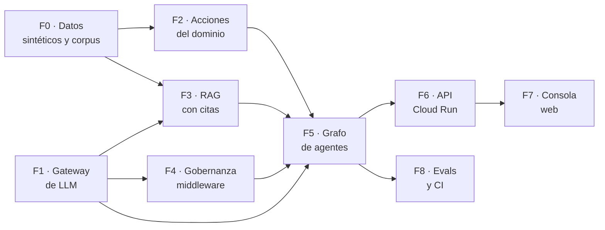

# Mapa de acción

Plan de trabajo para llevar SynapseFlow desde su estado actual —la capa de
dominio y la de persistencia— hasta un sistema que ejecute el recorrido completo
de punta a punta.

Este documento existe para responder tres preguntas en cualquier momento del
proyecto: **qué falta**, **en qué orden** y **cómo se sabe que una fase terminó**.

> **¿Vas a escribir código?** Este documento da la vista general. El desglose
> ejecutable —commit por commit, con instrucciones y verificación— está en
> [`docs/plan/`](plan/), y el punto de entrada obligatorio es:
>
> ```bash
> python -m scripts.estado
> ```

- **Estado del documento:** vigente
- **Última revisión:** 2026-08-06 (F0 y F1 completas; fase actual F2)

---

## 1 · Los cinco compromisos y su estado

El proyecto se sostiene sobre cinco compromisos de diseño. Tres están cumplidos;
dos están declarados pero todavía no operan. Esta tabla es la fuente de verdad y
se actualiza al cerrar cada fase.

| # | Compromiso | Estado | Qué falta |
|---|---|---|---|
| 1 | La ontología es declarativa, no código | ✅ **Cumplido** | — |
| 2 | La reversibilidad es un atributo del dominio | ◐ **Parcial** | El compilador emite la configuración del gate; falta el grafo que la aplique en ejecución real |
| 3 | El modelo no calcula números | ○ **Declarado** | `calcular_vida_remanente` existe en el YAML sin implementación en Python |
| 4 | Sin cita no hay respuesta | ○ **Declarado** | No hay recuperación ni nodo verificador |
| 5 | Los datos sensibles no salen del perímetro | ◐ **Parcial** | Ya hay **un solo camino de salida**, garantizado por un test estructural sobre el AST del paquete. Falta el tokenizador que redacta en ese punto |

> Un compromiso declarado y no implementado es deuda visible. El objetivo de este
> plan es que la tabla quede en ✅ de arriba a abajo.

## 2 · Qué existe hoy

Verificado sobre el repositorio, no sobre la memoria:

```
packages/synapseflow/
  cli.py               ✅  inspección del dominio sin credenciales
  config.py            ✅  configuración centralizada
  ontology/            ✅  schema · loader · compiler · oil_and_gas.yaml
  persistence/         ✅  client · vectorstore · checkpointer
  llm/                 ✅  registry · gateway · callbacks · fake · models.yaml
scripts/               ✅  estado.py · generar_datos.py · seed.py
data/corpus/           ✅  seis documentos de normativa, uno derogado
tests/                 ✅  204 tests; 189 sin dependencia externa
```

No existen todavía: `domain/`, `rag/`, `governance/`, `agents/`,
`services/api/`, `apps/web/`, `evals/`.

> Esta sección afirmaba hasta el 2026-08-06 que `llm/` tenía «solo models.yaml,
> sin código», que la suite tenía 70 tests y que la capa de ontología no tenía
> tests propios. Las tres cosas habían dejado de ser ciertas y el encabezado
> decía «vigente». Es la misma clase de deriva que el documento existe para
> evitar: **el estado que se mantiene a mano se desincroniza**. El que no se
> desincroniza es `python -m scripts.estado`, porque se deriva del código.

## 3 · Dependencias entre fases

El orden no es arbitrario. Cada flecha significa «no se puede empezar sin».



**F0 y F1 son independientes entre sí:** se pueden hacer en cualquier orden. Todo
lo demás depende de al menos una de las dos.

## 4 · Bloqueos externos

Dos cosas dependen de una acción humana y conviene resolverlas temprano porque
condicionan la verificación de varias fases.

Estado verificado contra el proyecto `synapseflow-5fc52` el **2026-08-06**:

| Bloqueo | Bloquea | Estado |
|---|---|---|
| **API key de Gemini** | Verificar en vivo F1, F3, F5, F8 | ✅ resuelto — `GOOGLE_API_KEY` en `.env` |
| **Plan Blaze en el proyecto Firebase** | Desplegar F6 y F7 | ✅ resuelto — facturación habilitada |
| **API de Firestore habilitada** | Salir del emulador: ingesta real de F3, y F6 | ❌ **pendiente** — `firestore.googleapis.com` está deshabilitada |

**El código de todas las fases se puede escribir y testear sin ninguno de los
tres**, usando el modelo falso y el emulador de Firestore. Lo que no se puede sin
la clave es comprobar que el agente responde bien de verdad.

> El tercer bloqueo es nuevo y no estaba anotado. `firebase deploy` de reglas e
> índices, y cualquier escritura fuera del emulador, fallan hasta habilitar la
> API en el proyecto. Importa antes de F3: el índice vectorial de 768 dimensiones
> que declara `firestore.indexes.json` **todavía no existe en la nube**, y crear
> uno es lo único que fija su dimensión de forma irreversible.
>
> Se resuelve con:
>
> ```bash
> gcloud services enable firestore.googleapis.com --project synapseflow-5fc52
> firebase deploy --only firestore:rules,firestore:indexes
> ```

---

## 5 · Las fases

Cada fase declara su objetivo, qué archivos produce, cómo se verifica y qué
compromiso cierra. Una fase no está terminada hasta que su verificación pasa.

### F0 · Datos sintéticos y corpus normativo

**Objetivo.** Que el dominio tenga contenido: activos, inspecciones, órdenes de
trabajo y un cuerpo de normativa sobre el que buscar.

**Produce**

```
scripts/generar_datos.py      instalaciones, activos, inspecciones, órdenes
scripts/redactar_corpus.py    corpus de normativa reescrito
scripts/seed.py               carga idempotente a Firestore
data/corpus/*.md              los documentos fuente, versionados
```

**Decisiones de contenido**

- Los datos son **sintéticos y coherentes**: las mediciones de espesor de un
  activo deben describir una curva de corrosión creíble en el tiempo, porque el
  cálculo de vida remanente se apoya en ellas.
- Al menos un activo tiene que quedar **por debajo de su `t_min`**: es el caso que
  ejercita el recorrido completo hasta el gate de aprobación.
- El corpus **parafrasea** la estructura y el criterio de los códigos de
  inspección en servicio de API sin reproducir su texto, que tiene derechos.

**Verificación**

- `python -m scripts.seed --dry-run` reporta qué escribiría, sin escribir.
- Correr el seed dos veces deja la misma cantidad de documentos: la ingesta es
  idempotente por hash de contenido.
- Un test comprueba que existe al menos un activo con `espesor_medido` por
  debajo de `espesor_minimo_requerido`.

---

### F1 · Gateway de LLM

**Objetivo.** Un único punto por donde pasan todas las llamadas a modelos. Es la
precondición de los compromisos 4 y 5: sin un solo camino de salida, ninguna
garantía sobre los datos es verificable.

**Produce**

```
packages/synapseflow/llm/
  registry.py     perfil de tarea + proveedor → modelo, desde models.yaml
  gateway.py      adapters Gemini · OpenAI · Azure OpenAI · Anthropic
  callbacks.py    contabilidad de tokens y costo a Firestore
  fake.py         modelo determinístico para tests, sin red
```

**Decisiones**

- El código pide un **perfil** (`router`, `synthesis`, `verifier`, `embedding`),
  nunca un nombre de modelo. Ver [ADR-0004](adr/0004-gateway-provider-agnostic.md).
- El gateway valida al arrancar que la dimensión del modelo de embeddings
  coincida con la declarada en `firestore.indexes.json`. Un desajuste ahí obliga
  a reindexar el corpus completo, y conviene descubrirlo antes de la ingesta.
- `fake.py` no es un detalle menor: permite testear todo el grafo sin gastar
  cuota ni depender de la red.

**Verificación**

- Test estructural: ningún módulo fuera de `synapseflow.llm` importa un
  `ChatModel` de un proveedor. Se comprueba recorriendo los imports del paquete.
- `tests/llm/test_pricing_freshness.py` falla si el catálogo de precios lleva más
  de noventa días sin verificarse.
- Con `GOOGLE_API_KEY` presente, un test marcado `live_llm` hace una llamada real.

---

### F2 · Acciones del dominio

**Objetivo.** Que las nueve acciones declaradas en el YAML tengan implementación.
Hoy el compilador falla si falta alguna, así que esta fase es lo que permite
compilar el catálogo completo.

**Produce**

```
packages/synapseflow/domain/
  repository.py   acceso a Firestore por entidad, tipado
  lecturas.py     buscar_normativa · consultar_activo · listar_activos
                  historial_inspecciones
  calculos.py     calcular_vida_remanente
  escrituras.py   registrar_borrador_ot · emitir_orden_trabajo
                  solicitar_parada_equipo · reclasificar_criticidad
```

**Cierra el compromiso 3.** `calculos.py` implementa el método de la sección 7 de
API 570 en Python determinístico:

```
velocidad de corrosión = (espesor_anterior − espesor_actual) / años transcurridos
vida remanente         = (espesor_actual − t_min) / velocidad de corrosión
```

El modelo recibe el número ya calculado como hecho, junto con las mediciones que
lo sustentan. No estima magnitudes.

**Verificación**

- `compile_tools(onto, "inspector")` devuelve 9 herramientas sin lanzar
  `CompilationError`. Hoy lanza.
- Tests de `calculos.py` con casos de borde: una sola medición —no se puede
  calcular velocidad—, espesor creciente —medición sospechosa—, vida remanente
  negativa.
- Un test verifica que ninguna función de `escrituras.py` se pueda invocar sin
  contexto de usuario.

---

### F3 · RAG con citas obligatorias

**Objetivo.** Que el agente responda sobre normativa con fundamento verificable.

**Produce**

```
packages/synapseflow/rag/
  ingesta.py      trocear y vectorizar el corpus
  retrievers.py   híbrido: FirestoreVectorStore + BM25 vía EnsembleRetriever
  citas.py        extracción y validación de documento + sección
  fundamento.py   verificador de respaldo
```

**Cierra el compromiso 4.** El verificador recibe la respuesta redactada y los
fragmentos recuperados, y comprueba que cada afirmación normativa tenga respaldo.
Si no lo tiene, la respuesta no se emite: el sistema declara que no sabe.

**Decisiones**

- Los filtros de igualdad —`vigencia: vigente`— se aplican **antes** del
  `find_nearest`, no después. Filtrar después desperdicia cupo de resultados.
- BM25 se implementa sobre `rank_bm25` como `BaseRetriever` propio, para no
  arrastrar `langchain-community` entero.
- **Negarse a responder es una métrica de éxito**, no un fallo. Se mide en F8.

**Verificación**

- Un test hace una pregunta cuya respuesta no está en el corpus y verifica que el
  sistema se niegue en lugar de improvisar.
- Un test verifica que un fragmento marcado `derogado` nunca aparezca como
  fundamento.
- Toda respuesta normativa incluye al menos una cita con documento y sección.

---

### F4 · Gobernanza como middleware

**Objetivo.** Que las garantías sobre datos y permisos sean una capa que
atraviesa a todos los agentes, no código repetido en cada uno.

**Produce**

```
packages/synapseflow/governance/
  pii.py          detector de legajos + tokenización estable y rehidratación
  auditoria.py    escritura del log inmutable
  politica.py     enforcement de zero-training
  rbac.py         contexto de ejecución con el rol del usuario
  middleware.py   ensamblado del pipeline
```

**Cierra el compromiso 5.** Los campos marcados `pii` o `restricted` en la
ontología se reemplazan por tokens estables —`«INSPECTOR_1»`— antes de la llamada
al proveedor, y se rehidratan en la respuesta.

**Decisiones**

- Se construye sobre `AgentMiddleware` de LangChain 1.x, con
  `PIIMiddleware` y un detector propio para el formato de legajo del dominio.
  Ver el hallazgo de versiones en [ADR-0002](adr/0002-integraciones-firestore-propias.md).
- El log de auditoría registra `thread_id` y `checkpoint_id`, de modo que un
  auditor pueda reconstruir **el razonamiento** que llevó a una propuesta, no
  solo el hecho de que ocurrió.

**Verificación**

- `tests/governance/test_frontera_datos.py`: un payload con un campo
  `restricted` nunca llega al adapter con el valor original.
- Test negativo: un usuario sin `approver_roles` no puede reanudar un gate.
- Test negativo: el proponente no puede aprobar su propia acción.

---

### F5 · Grafo de agentes

**Objetivo.** El agente completo: supervisor, especialistas, verificador y los
frenos de aprobación aplicados de verdad.

**Produce**

```
packages/synapseflow/agents/
  state.py        AgentState tipado y estrecho
  supervisor.py   ruteo y planificación
  especialistas.py  normativa · datos · cálculo
  verificador.py  chequeo de fundamento antes de emitir
  graph.py        ensamblado y compilación
```

**Cierra el compromiso 2 en ejecución real.** El `HumanInTheLoopMiddleware` se
configura con `interrupt_config(ontology, role)`: los gates se derivan del YAML,
no se escriben a mano.

**Verificación**

- **Test estructural**: se recorre el grafo compilado y se verifica que ninguna
  acción con `reversible: false` sea alcanzable sin pasar por un gate. Se
  comprueba sobre la estructura, sin invocar las acciones.
- El recorrido completo del caso P-2101-A: consulta → cálculo → normativa →
  propuesta de parada → gate.
- El test de supervivencia del § HITL se extiende del grafo de prueba al real.

---

### F6 · API en Cloud Run

**Objetivo.** Exponer el agente por HTTP con streaming, identidad y permisos.

**Produce**

```
services/api/
  main.py         FastAPI
  streaming.py    astream_events → SSE
  auth.py         Firebase Auth → rol de la ontología
  aprobaciones.py endpoints del gate
  Dockerfile
```

**Decisiones**

- El agente hereda los permisos **del usuario**, nunca los de la cuenta de
  servicio. El rol sale del token de Firebase Auth y se resuelve contra la
  ontología.
- Cloud Run y no Cloud Functions: control total de la imagen para un árbol de
  dependencias grande. Requiere un ADR-0006.

**Verificación**

- Un usuario con rol `consulta` recibe 403 al intentar aprobar.
- El streaming emite eventos de herramienta antes del texto final.
- Prueba de arranque en frío con el árbol de dependencias completo.

---

### F7 · Consola web

**Objetivo.** La pantalla donde Marta pregunta y el supervisor aprueba.

**Produce**

```
apps/web/
  chat con citas desplegables
  bandeja de aprobaciones
  explorador de la ontología
  panel de costos
```

**Verificación**

- El circuito completo de aprobación desde el navegador.
- Las citas enlazan al fragmento exacto del corpus.

---

### F8 · Evaluación y CI de regresión

**Objetivo.** Que un cambio de prompt que empeora la calidad no llegue a `main`.

**Produce**

```
evals/
  datasets/       golden dataset del dominio
  evaluadores/    fidelidad · precisión de citas · corrección del rechazo
  run.py
.github/workflows/evals.yml
```

**Métricas**

| Métrica | Qué mide |
|---|---|
| Fidelidad | Que la respuesta no afirme lo que las fuentes no dicen |
| Precisión de citas | Que documento y sección existan y sean pertinentes |
| **Corrección del rechazo** | Que se niegue cuando no hay fundamento |
| Latencia p95 · costo por consulta | Que sea operable |

**Verificación.** El CI corre las evals en cada pull request y bloquea el merge
ante regresión respecto de la línea base.

---

## 6 · Orden de ejecución recomendado

```
1. F1  Gateway            ─┐  independientes entre sí
2. F0  Datos y corpus     ─┘
3. F2  Acciones del dominio
4. F3  RAG con citas
5. F4  Gobernanza
6. F5  Grafo de agentes        ← acá el sistema responde de punta a punta
7. F8  Evals
8. F6  API
9. F7  Consola
```

**Por qué las evals antes que la API.** Una vez que el grafo responde, lo que
protege la calidad es la suite de evaluación. Construir la API primero adelanta
la demo pero deja el núcleo sin red de contención justo cuando empieza a
cambiar seguido.

**El hito que más importa es el 6.** Ahí el sistema deja de ser piezas y hace el
recorrido completo: pregunta sobre un activo, cálculo determinístico, fundamento
normativo con citas, propuesta de acción irreversible y freno esperando a un
humano. Todo lo posterior lo hace usable por otros; el hito 6 lo hace verdadero.

## 7 · Cómo se actualiza este documento

Al cerrar una fase:

1. Marcar el compromiso correspondiente en la tabla de la sección 1.
2. Actualizar la tabla de estado del [README](../README.md) y de
   [README.es](../README.es.md) — el CI verifica que ambos cambien juntos.
3. Anotar la fase en el [CHANGELOG](../CHANGELOG.md).
4. Si la fase tomó una decisión estructural, escribir su ADR.
